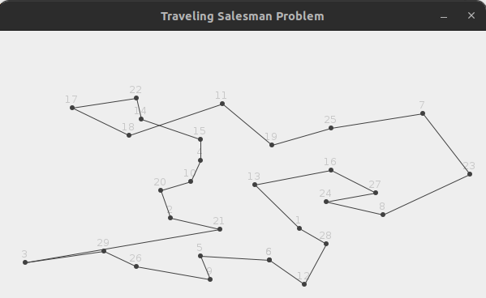

### Ant Colony Optimization (ACO) for the Traveling Salesman Problem (TSP)

This project implements the Ant Colony Optimization (ACO) algorithm to solve the Traveling Salesman Problem (TSP) in Java. ACO is inspired by the foraging behavior of ants and is used for finding optimal paths through graphs.

#### Features
- ACO algorithm implementation
- Visualization of the TSP solution
- Configurable algorithm parameters
- Example dataset for demonstration

#### Requirements
- Java Development Kit (JDK) 8 or higher

#### Project Structure
```
ACO/
├── Ants/
│   ├── Ant.java
│   └── AntColonyOptimization.java
├── Display/
│   └── WindowTSP.java
├── Graph/
│   ├── Edge.java
│   ├── Graph.java
│   ├── Node.java
│   └── Vertex.java
├── IO/
│   ├── Import.java
│   └── bays29.tsp
├── Sample/
│   └── sample_run.gif
└── Main.java
```
#### Getting Started
1. Clone the repository
```
git clone https://github.com/NathanaelTamirat/Ant-colony-optimization.git
```
2. Compile the Project
```
javac Ants/*.java Display/*.java Graph/*.java IO/*.java Main.java
```
3. Run the Example
```
java Main
```
#### Graph Visualization
The WindowTSP class is used to visualize the TSP solution. When you run the Main class, a window will display the optimal tour found by the ACO algorithm.

